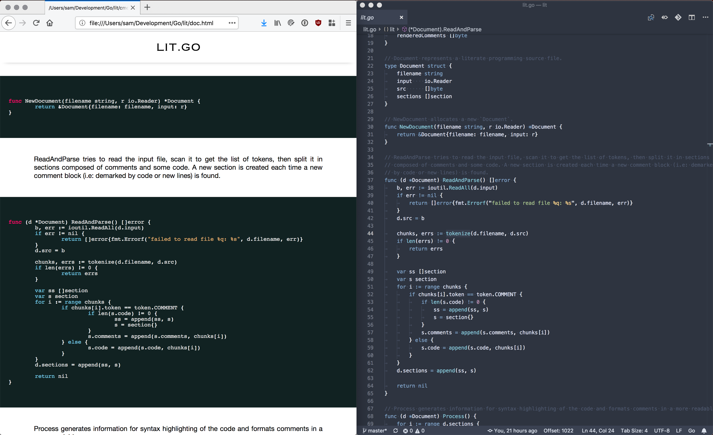

# Literate Go [](https://travis-ci.org/dgellow/lit) [](https://godoc.org/github.com/dgellow/lit) [](https://goreportcard.com/report/github.com/dgellow/lit)

The tool `lit` generates clean and readable documents from a commented go source code. Instead of embedding source code in your prose, write your prose in your source code. The main goal of this tool is to help writing technical articles discussing or presenting programs implementation. The approach is in some way the opposite of Markdown and other similar format focused on making it as easy as possible to write text, instead `lit` let you use the best tools and context (i.e: your editor) to write the program that will be at the core of the article, and use source code comments as your prose.

Install the command line tool with `go get github.com/dgellow/lit/cmd/lit`.

Usage is minimalistic:
```sh
$ lit -help
Usage of lit:
  -embedded
        if used, generate embeddable HTML instead of full document
  -input string
        input file (default "stdin")

# Example
$ lit -input github.com/dgellow/lit/lit.go > doc.html
```


